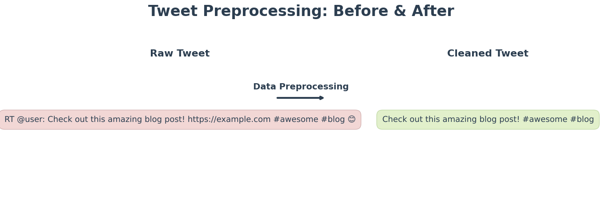
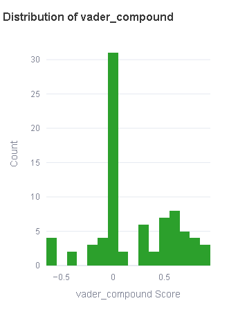
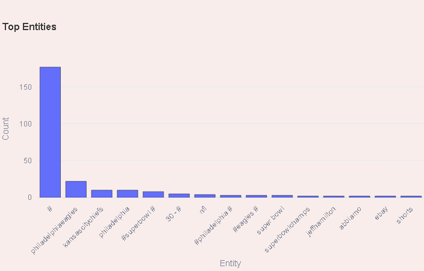

# Social Media Sentiment Analysis Dashboard

This project is an end-to-end pipeline for analyzing social media sentiment using Twitter data. It demonstrates data collection, cleaning, multiple NLP techniques, and interactive visualizations—all wrapped up in an easy-to-use Streamlit dashboard.

## Features

- **Data Preprocessing:**  
  Cleans raw tweets by removing URLs, retweet indicators, mentions, emojis, and extra whitespace. Also extracts keywords (hashtags) from tweets.

    
   
- **Sentiment Analysis:**  
  Uses NLTK VADER and TextBlob to analyze tweet sentiment. Creates numeric sentiment scores and discrete labels (positive, neutral, negative).

    

- **Named Entity Recognition (NER):**  
  Uses spaCy to extract named entities from tweet text, allowing analysis of frequently mentioned organizations, people, or locations.

  
    
- **Topic Modeling:**  
  Implements Latent Dirichlet Allocation (LDA) via gensim to automatically cluster tweets into topics.

- **Interactive Dashboard:**  
  A Streamlit dashboard with multiple interactive Plotly visualizations, including:
  - Sentiment distribution (numeric & label)
  - Sentiment correlation (VADER vs. TextBlob)
  - Sentiment over time
  - Keyword frequency
  - Entity frequency
  - Topic distribution
## Dashboard Demo

  [View MP4](images/Dashboard_demo.mp4)
## Project Structure

```
social-media-sentiment-dashboard/
├── data/
│   ├── raw/                    # Raw tweet data (not shared publicly)
│   └── processed/              # Processed CSV files (tweets_master.csv, etc.)
├── src/
│   ├── dashboard.py            # Streamlit dashboard for interactive visualizations
│   ├── visualization.py        # Plotly visualization functions
│   ├── preprocessing.py        # Data cleaning and keyword extraction script
│   └── nlp/
│       ├── sentiment_analysis.py   # Sentiment analysis functions (VADER and TextBlob)
│       ├── ner.py                  # Named Entity Recognition using spaCy
│       ├── topic_modeling.py       # Topic modeling functions using gensim LDA
│       └── topic_modeling_integration.py  # Integration script for topic modeling on tweets
│   └── style.css               # Custom CSS for dashboard styling
├── .gitignore                  # Files and folders to ignore in Git (e.g., raw data, virtual env)
└── README.md                   # This documentation file
```

## How to Run

### 1. Set Up the Environment

Clone the repository and create a virtual environment:

```bash
git clone https://github.com/yourusername/social-media-sentiment-dashboard.git
cd social-media-sentiment-dashboard
python -m venv venv
```

Activate the virtual environment:

On macOS/Linux:
```bash
source venv/bin/activate
```

On Windows:
```bash
venv\Scripts\activate
```

### 2. Install Dependencies

All dependencies are listed in `requirements.txt`.

Install the required packages:
```bash
pip install -r requirements.txt
```

Download necessary NLTK data and spaCy models:
```bash
python -m spacy download en_core_web_sm
python -c "import nltk; nltk.download('vader_lexicon'); nltk.download('stopwords')"
```

### 3. Data Preprocessing

Run the preprocessing script to clean the raw tweets and extract keywords:
```bash
python src/preprocessing.py
```
### 4. Run NLP Pipelines

Run the sentiment analysis, NER, and topic modeling scripts to process the cleaned tweets:
```bash
python src/nlp/sentiment_analysis.py
python src/nlp/ner.py
python src/nlp/topic_modeling_integration.py
```

### 5. Merge Datasets

If you wish to combine all processed data into a single master file, run:
```bash
python src/merge_datasets.py
```
This will create a `tweets_master.csv` in `data/processed/` containing all the information.

### 6. Launch the Dashboard

Finally, run the Streamlit dashboard:
```bash
streamlit run src/dashboard.py
```

## Data Privacy

Due to Twitter’s policies and privacy considerations, raw tweet data is not shared publicly. Only processed data (with anonymized or aggregated content) is provided in this project. If you wish to run the project yourself, you can collect your own data using Twitter's API.

## Customization

### Theming

Modify the `.streamlit/config.toml` file and `src/style.css` to change the color scheme and overall styling.

### Filters & Visualizations

The dashboard is modular, so you can add or remove filters and charts by editing `src/dashboard.py` and `src/visualization.py`.

## License

MIT License

This project is licensed under the MIT License. See below for details.

```
MIT License

Permission is hereby granted, free of charge, to any person obtaining a copy of this software and associated documentation files (the "Software"), to deal in the Software without restriction, including without limitation the rights to use, copy, modify, merge, publish, distribute, sublicense, and/or sell copies of the Software, and to permit persons to whom the Software is furnished to do so, subject to the following conditions:

The above copyright notice and this permission notice shall be included in all copies or substantial portions of the Software.

THE SOFTWARE IS PROVIDED "AS IS", WITHOUT WARRANTY OF ANY KIND, EXPRESS OR IMPLIED, INCLUDING BUT NOT LIMITED TO THE WARRANTIES OF MERCHANTABILITY, FITNESS FOR A PARTICULAR PURPOSE AND NONINFRINGEMENT. IN NO EVENT SHALL THE AUTHORS OR COPYRIGHT HOLDERS BE LIABLE FOR ANY CLAIM, DAMAGES OR OTHER LIABILITY, WHETHER IN AN ACTION OF CONTRACT, TORT OR OTHERWISE, ARISING FROM, OUT OF OR IN CONNECTION WITH THE SOFTWARE OR THE USE OR OTHER DEALINGS IN THE SOFTWARE.
```

## Acknowledgements

This project uses spaCy, gensim, NLTK, and Streamlit. Data is collected via Twitter’s API.